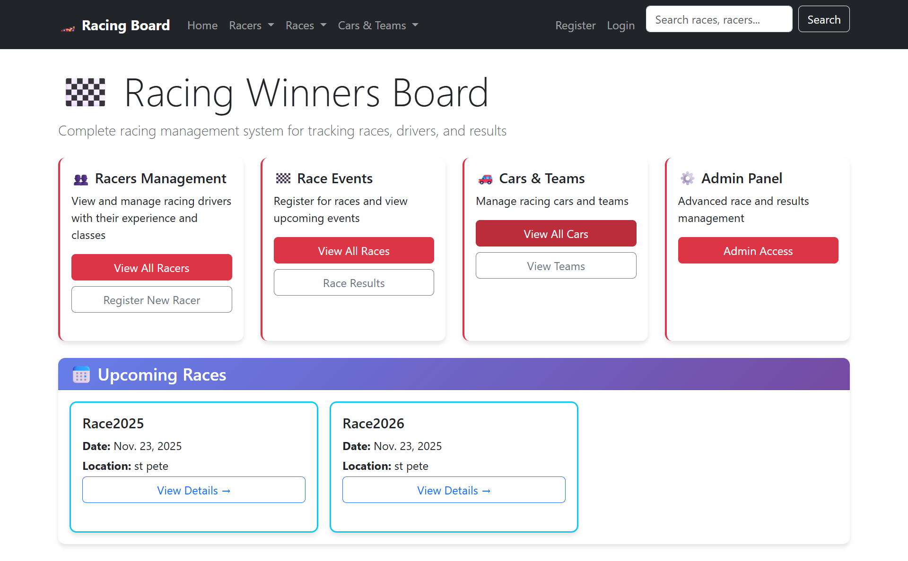
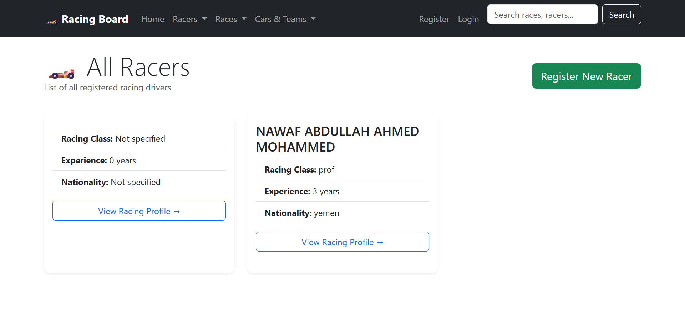
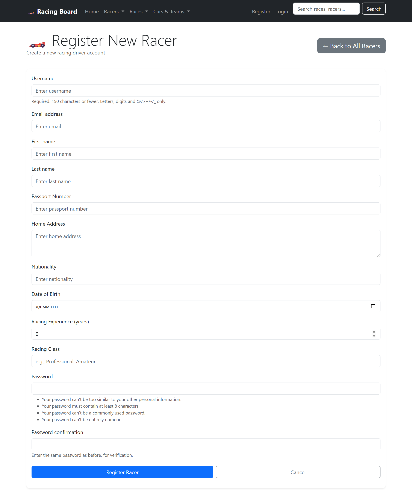
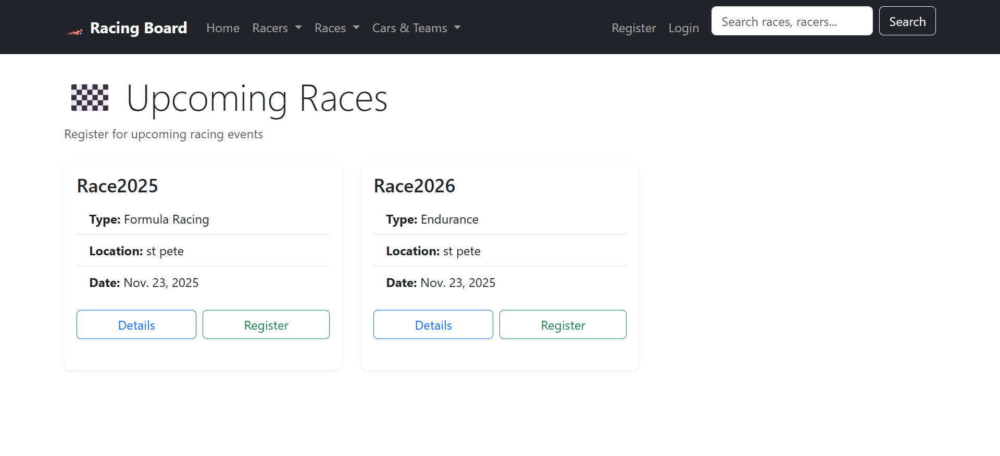
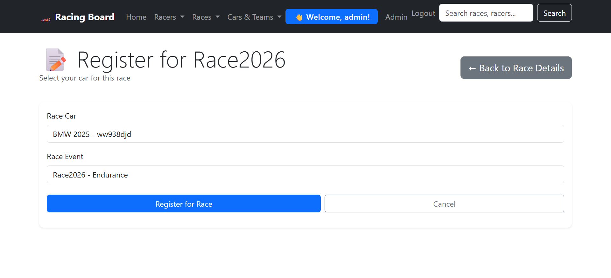
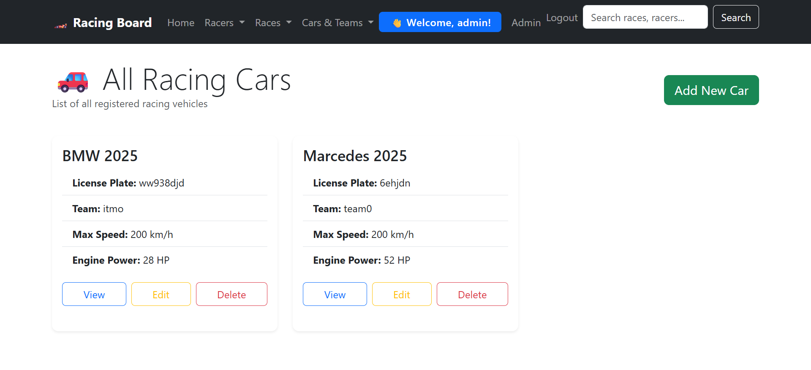
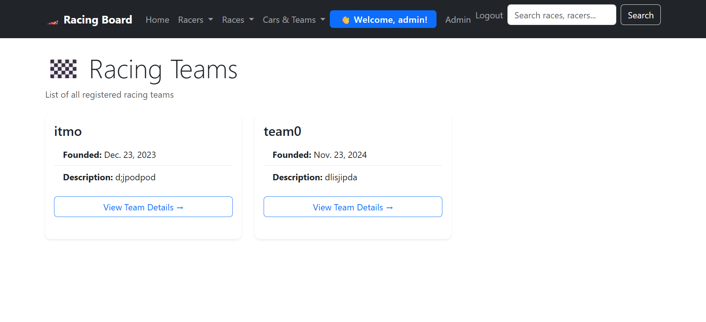
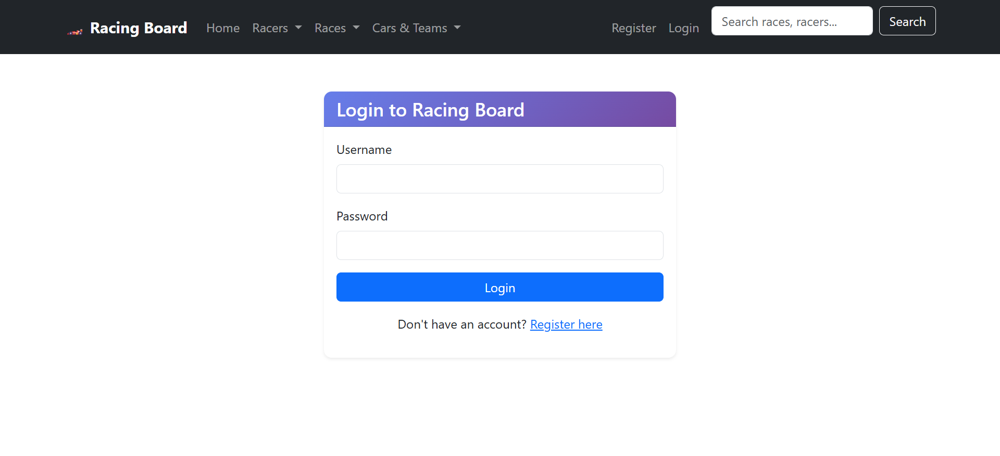

# Лабораторная работа №2 — Система управления автогонками

**Студент:** Саид Наваф  
**Группа:** K3341  
**Вариант:** №6 — Табло победителей автогонок

---

## Оглавление
- [Введение](#введение)
- [Техническое задание](#техническое-задание)
- [Архитектура системы](#архитектура-системы)
- [Реализация](#реализация)
- [Интерфейсы](#интерфейсы)
- [Установка и запуск](#установка-и-запуск)
- [Отчет по лабораторной работе](#отчет-по-лабораторной-работе)
- [Заключение](#заключение)

---

## Введение

Данная лабораторная работа представляет собой веб-приложение для управления автогонками, разработанное на фреймворке Django. Система позволяет регистрировать гонщиков, организовывать гонки, управлять командами и автомобилями, а также отслеживать результаты соревнований.

## Техническое задание

### Основные требования:
- Регистрация новых пользователей (гонщиков)
- Просмотр и регистрация на гонки
- Система комментариев с рейтингами (1-10)
- Административная панель для управления результатами
- Таблица результатов за последние 30 дней

### Дополнительные функции:
- Пагинация страниц
- Поиск по всем объектам системы
- Современный интерфейс с Bootstrap 5
- Адаптивный дизайн
- Кастомная модель пользователя

## Архитектура системы

### Модели данных

```python
class User(AbstractUser):
    passport_number = models.CharField(max_length=20)
    home_address = models.TextField()
    nationality = models.CharField(max_length=50)
    racing_experience = models.IntegerField(default=0)
    racing_class = models.CharField(max_length=50)

class Team(models.Model):
    name = models.CharField(max_length=100)
    description = models.TextField()
    founded_date = models.DateField()

class Car(models.Model):
    license_plate = models.CharField(max_length=10)
    brand = models.CharField(max_length=50)
    model = models.CharField(max_length=50)
    team = models.ForeignKey(Team, on_delete=models.SET_NULL)
    max_speed = models.IntegerField()
    engine_power = models.IntegerField()

class Race(models.Model):
    name = models.CharField(max_length=200)
    race_type = models.CharField(max_length=20, choices=RACE_TYPES)
    location = models.CharField(max_length=200)
    date = models.DateField()

class RaceRegistration(models.Model):
    racer = models.ForeignKey(User, on_delete=models.CASCADE)
    car = models.ForeignKey(Car, on_delete=models.CASCADE)
    race = models.ForeignKey(Race, on_delete=models.CASCADE)
    lap_time = models.DurationField()
    final_position = models.IntegerField()

class RaceComment(models.Model):
    author = models.ForeignKey(User, on_delete=models.CASCADE)
    race = models.ForeignKey(Race, on_delete=models.CASCADE)
    comment_type = models.CharField(max_length=20, choices=COMMENT_TYPES)
    text = models.TextField()
    rating = models.IntegerField(choices=[(i, i) for i in range(1, 11)])
```

## Реализация
- Проект реализован на Django 5, с использованием кастомной модели пользователя.
- Для всех страниц реализованы CRUD-операции, пагинация, поиск, современный дизайн с Bootstrap 5.
- Все шаблоны приведены к единому стилю, реализована навигация, формы, обработка ошибок.

## Интерфейсы
### Главная страница


### Список гонщиков


### Регистрация гонщика


### Список гонок


<!-- ### Детали гонки
 -->

### Регистрация на гонку


### Список машин


### Список команд


### Вход в систему


<!-- ### Успешный выход
 -->

<!-- ### Пример поиска
 -->

<!-- ### Админ-панель
 -->

## Установка и запуск
1. Клонировать репозиторий и перейти в папку проекта.
2. Установить зависимости: `pip install -r requirements.txt`
3. Применить миграции: `python manage.py migrate`
4. Создать суперпользователя: `python manage.py createsuperuser`
5. Запустить сервер: `python manage.py runserver`
6. Для генерации отчета: `mkdocs serve` (запускать из корня проекта)

## Отчет по лабораторной работе
### Цель работы
Разработать современное веб-приложение для управления автогонками с возможностью регистрации гонщиков, организации гонок, управления командами и автомобилями, а также отображения и анализа результатов соревнований. Оформить проект с использованием Django, Bootstrap и подготовить отчет в формате Markdown с помощью MkDocs.

### Ход работы
1. Настройка проекта, запуск сервера, создание моделей.
2. Реализация основных функций: регистрация, просмотр, редактирование, удаление объектов.
3. Оформление шаблонов, подключение Bootstrap, настройка навигации.
4. Реализация поиска, пагинации, системы комментариев и рейтингов.
5. Исправление ошибок, тестирование, оформление отчета.

### Результаты
- Все основные функции реализованы и протестированы.
- Интерфейс современный и удобный.
- Отчет оформлен с примерами и скриншотами.

### Заключение
В ходе работы были получены навыки по созданию и стилизации Django-приложений, работе с шаблонами, настройке маршрутизации, использованию MkDocs и оформлению технической документации. Все сложности были успешно решены.