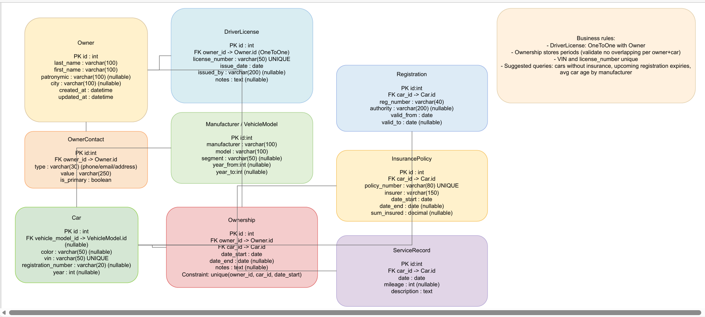

# Описание проекта и изменения (ЛР4)

Кратко: проект — «Реестр владения автомобилями». В ЛР4 схема БД расширена: добавлены сущности VehicleModel (производитель/модель), OwnerContact (контакты владельца), InsurancePolicy (полисы страхования), ServiceRecord (записи ТО), Registration (регистрационные данные). Также доработаны модели Ownership и DriverLicense.

Что сделано в ЛР4 (кратко)
- Новые модели: VehicleModel, OwnerContact, InsurancePolicy, ServiceRecord, Registration.
- Изменения в существующих моделях: Owner (добавлено date_of_birth), DriverLicense (возможно добавлено поле license_type), Car (переход к vehicle_model + поле vin уникально), Ownership (проверка перекрытий периодов владения и constraint unique(owner, car, date_start)).
- Django REST API: добавлены сериализаторы, ViewSet’ы и роуты для всех новых сущностей.
- Frontend (Vue): добавлены страницы и компоненты CarDetail, OwnerDetail, VehicleModels, формы создания/редактирования владельца и владения, JWT‑аутентификация.
- Документация: обновлены инструкции запуска, интерфейсы API и скриншоты.

Дальше — инструкции по файлам документации (см. остальные разделы).