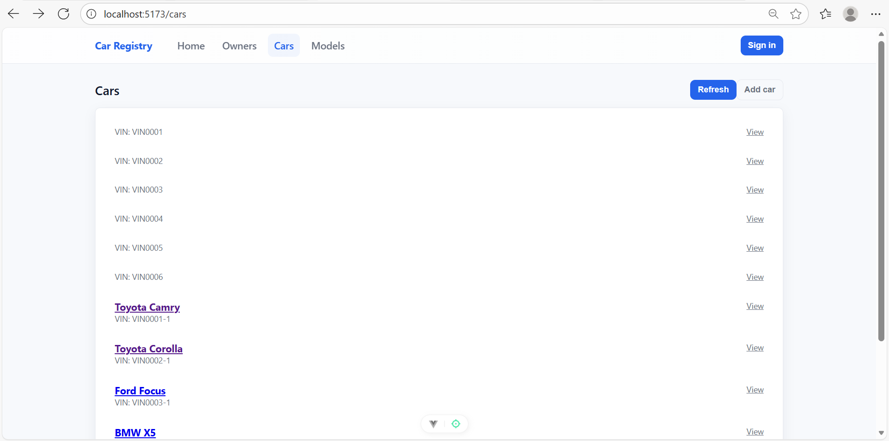
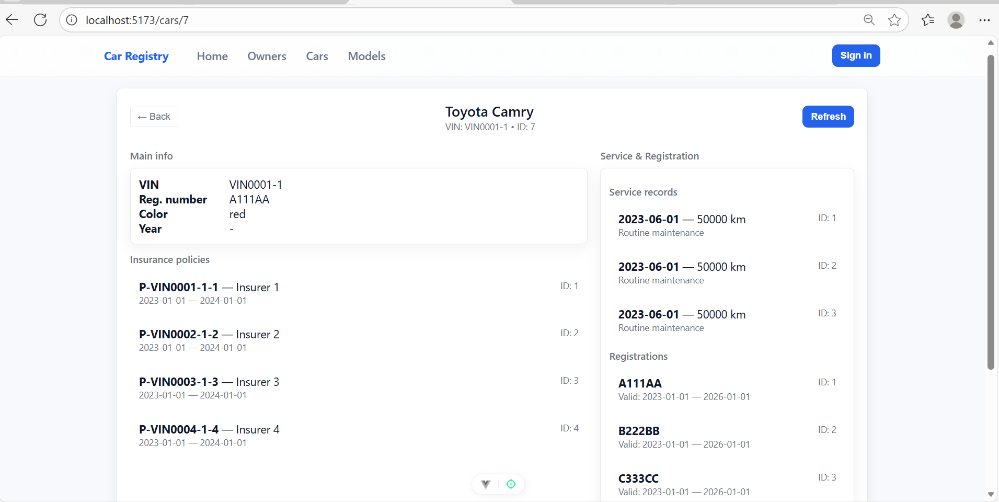
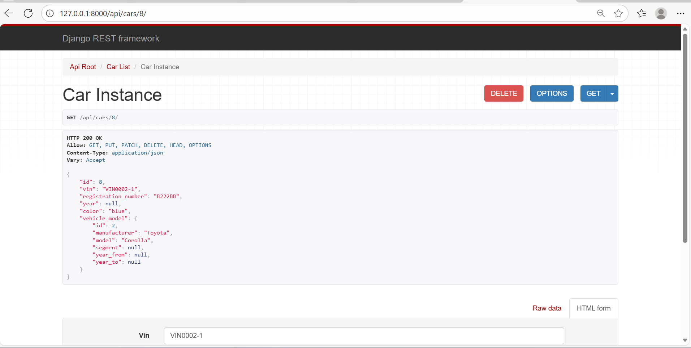
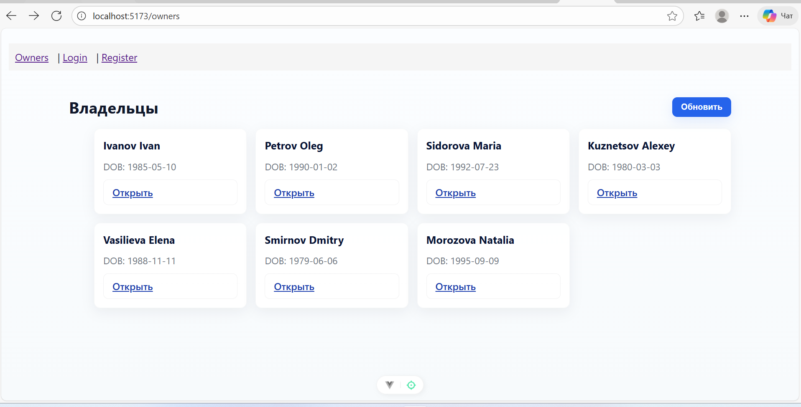
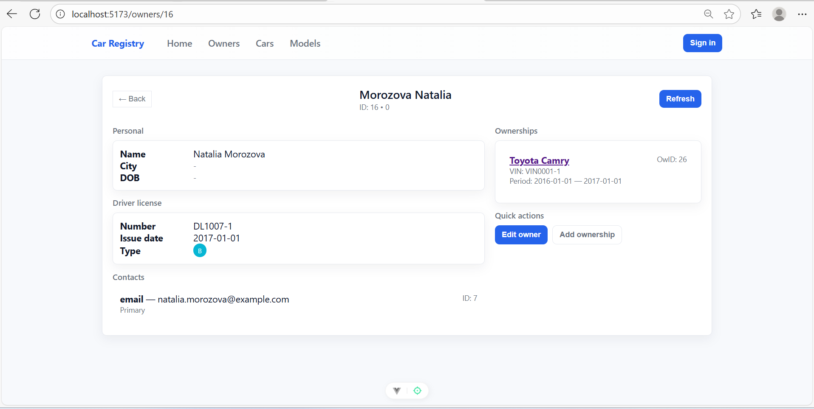
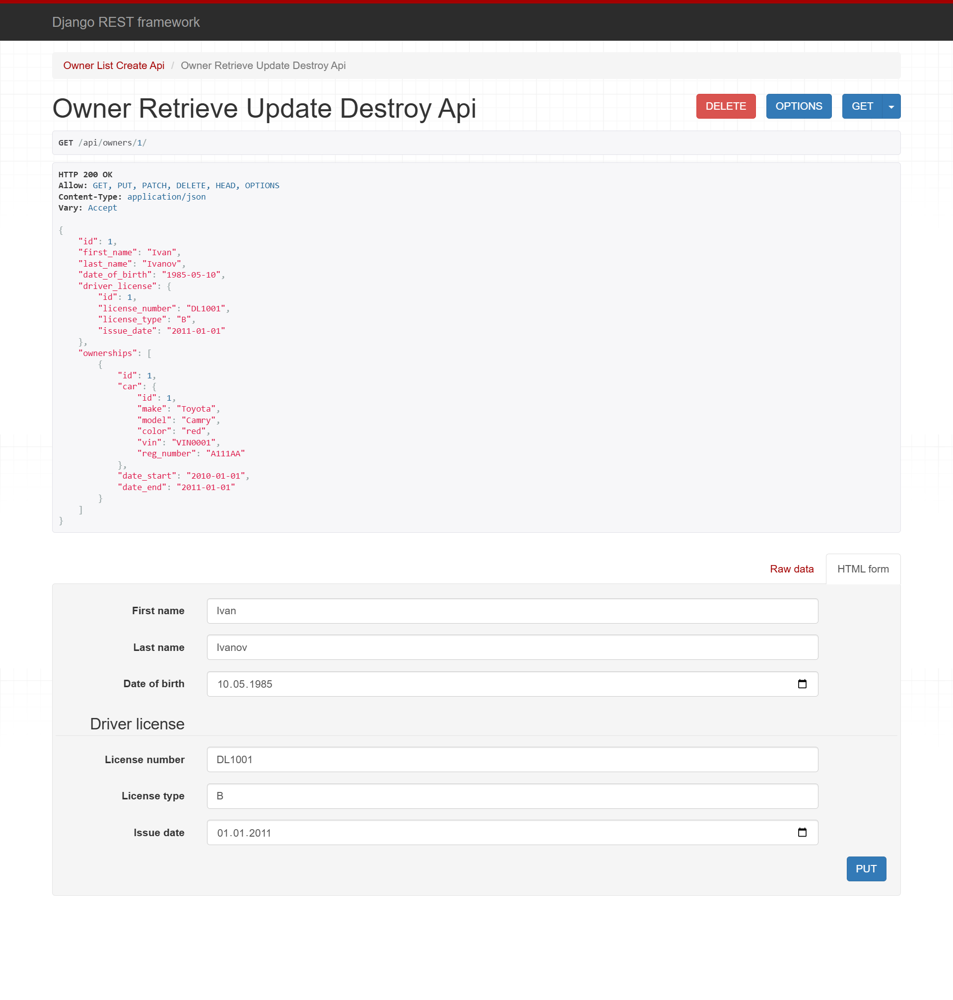

# Скриншоты интерфейса и API

1) Список автомобилей
- Файл: `images/cars.png`  
- Кратко: страница со списком автомобилей, каждая запись показывает марку/модель и VIN. Используется для проверки списка и навигации в Car Detail.

2) Детальная страница автомобиля
- Файл: `images/car_detail.png`  
- Кратко: подробная информация об автомобиле — модель, VIN, регистрация, список страховок, сервисная история и регистрационные записи.

3) Пример ответа API для Car Detail
- Файл: `images/car_detail_api.png`  
- Кратко: пример JSON‑ответа от эндпойнта `GET /api/cars/{id}/` (показывает структуру полей автомобиля; связные списки страховок/сервисов/регистраций могут доставаться отдельными запросами или быть вложены).

4) Список владельцев
- Файл: `images/owners.png`  
- Кратко: страница со списком владельцев (ФИО, город). Отсюда переход к детальной странице владельца.

5) Детальная страница владельца
- Файл: `images/owner_details.png`  
- Кратко: детальная информация по владельцу — контакты, водительское удостоверение, периоды владения с ссылками на автомобили.

6) Пример ответа API для Owner Detail
- Файл: `images/owner_details_api.png`  
- Кратко: пример JSON‑ответа от эндпойнта `GET /api/owners/{id}/` — показывает вложенные поля `driver_license`, `contacts`, `ownerships` (ownerships с информацией о связанных автомобилях).

